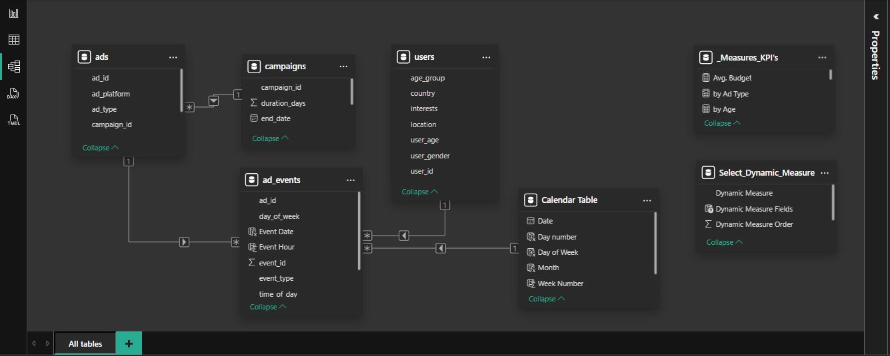
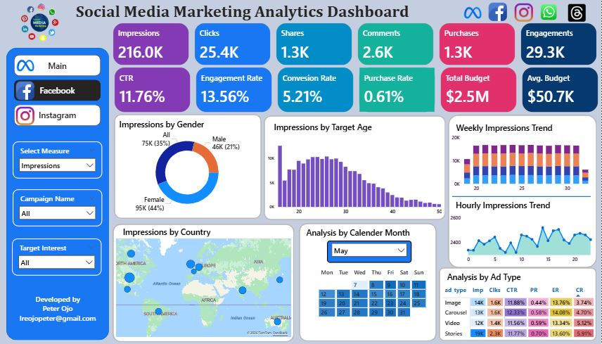
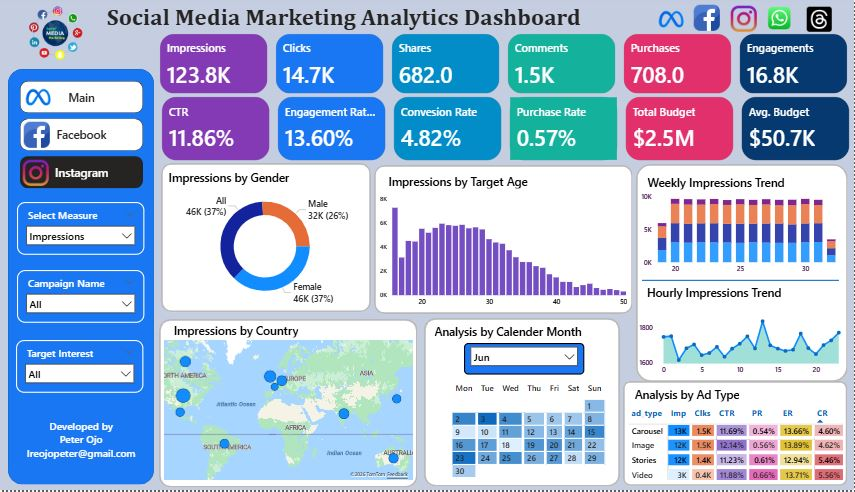

# Social Media Marketing Analysis

## Table of Content
- [Executive Summary](#executive-summary)
- [Summary Insights and Findings](#summary-insights-and-findings)
- [Project Objective](#project-objective)
- [Data Overview](#data-overview)
- [Key Insights and Findings](#key-insights-and-findings)
- [Recommendations](#recommendations)
- [Tools and Technologies Used](#tools-and-technologies-used)
- [How This Project Demonstrates My Skills](#how-this-project-demonstrates-my-skills)

## Executive Summary
This project analyses paid advertising performance across Facebook and Instagram to evaluate campaign effectiveness, audience behaviour, and return on ad spend. Using Meta Ads performance data, I built a structured data model and Power BI dashboard to track key KPIs including reach, engagement, conversions, and efficiency metrics.

The analysis shows that while campaigns achieve strong visibility and audience engagement—particularly among females aged 18–32—the conversion funnel underperforms, with only 0.60% of impressions resulting in purchases. Story and Image ad formats consistently outperform others, and engagement peaks during afternoon and evening hours across high-value markets such as the US and UK.

By identifying where users drop off in the purchase journey, this project provides clear, actionable recommendations to improve conversion rates, optimise ad scheduling, and reallocate budgets toward high-performing audiences and formats—demonstrating strong analytical thinking and commercial awareness.

## Summary Insights and Findings
- High CTR (11.79%) and Engagement Rate (13.58%)
- Low Purchase Rate (0.60%) and only 2K conversions out of 339.8K impressions
- Strong awareness and engagements
- Target audience: Females between the ages 18 to 32 shows more interest in the ads.
- Best ad format: Stories, Image, Carousel, and Video in that particular order.

[Jump to Detailed Insight](#key-insights-and-findings)

## Project Objective

The business needs a performance tracking report for advertising campaigns running on Facebook and Instagram. The report provides visibility into campaign reach, engagement, conversions, and budget utilization.

This will enable the marketing team to:
- Identify the most effective platform (Facebook vs Instagram)
- Track campaign ROI and optimize budget allocation.
- Understand audience engagement patterns.

## Data Overview

This dataset represents Meta Ads Performance Data, covering campaigns, ads, user demographics, and ad interaction events. It is modelled after how Facebook/Instagram (Meta) ad platforms capture data.

The purpose of this dataset is to analyse advertising performance, optimize targeting, and measure ROI (Return on Investment) through KPIs such as:
-Impressions (how often ads are seen)
- Clicks (engagement with ads)
- Purchases (conversions)
- CPM, CPC, CTR, and ROAS (efficiency metrics)
- Audience insights (demographics, location, interests)

This dataset is ideal for building a Power BI Dashboard to evaluate campaign effectiveness, budget utilization, and user engagement patterns.

### Dataset Scope
### In Scope:
- Campaigns running on Facebook and Instagram only

### Out of Scope:
- Other platforms (Messenger, Audience Network)
- Organic engagement (only paid ads will be included)

### Key Data Fields

#### Use of Each Table
 
 **Table 1: ad_events**
- Stores event-level logs (like impressions, clicks, purchases)
- This is the fact table in the model because all KPIs are derived from events.
- Used to analyze when and how users interact with ads.

**Table 2: ads**
- Contains details of each ad creative
- Defines targeting criteria and which campaign an ad belongs to.
- Used for platform-level and creative-type-level analysis (e.g., Facebook Video Ads vs Instagram Image Ads).

**Table 3: campaigns**
- High-level campaign strategy and budget allocation
- Provides timeframe and budget for ads
- Used to calculate cost-based KPIs (CPC, CPM, ROAS).

**Table 4: users**
- Stores demographic and interest information of users who interact with ads
- Used for audience segmentation (gender, age, country, location, interests).
- Helps analyze targeting efficiency (are ads reaching the right audience?).

### Relationship Configuration

How the Tables Work Together
- ad_events → ads → Links events to ad details (platform, type, targeting)
- ads → campaigns → Links ads to campaign metadata (budget, duration)
- ad_events → users → Links user engagement events to demographic data.

This creates a star schema:
- Fact Table: ad_events
- Dimension Tables: ads, campaigns, users

## Key Insights and Findings

### KPI Metrics
- Impressions: 339.8K: Total times the ads were shown. **Good reach.**
- Clicks: 40.1K: Number of people who clicked on the ads.
- Shares: 2K, Comments: 4.1K: Indicators of **organic engagement (beyond paid reach)**.
- Purchases (Conversions): 2.01K: Real customer acquisitions from ads.
- Engagements: 46.1K: Sum of clicks, likes, shares, comments.
- CTR (Click-Through Rate): 11.76%: Strong performance (above industry average ~1-2%). **Ads are very attractive.**
- Engagement Rate: 13.56%: **Very healthy; content resonates with the audience.**
- Conversion Rate: 5.07%: Out of all clicks, 5.07% converted into purchases. **Good but could improve with landing page optimization.**
- Purchase Rate: 0.60%:

#### Insights from KPIs;
- Out of impressions, only 0.60% resulted in purchases. Low conversion funnel efficiency (room to optimize)
Ads are performing strongly in visibility and engagement, but actual purchase efficiency is weak: need to optimize targeting/landing pages.
- High CTR (11.76%) and Engagement Rate (13.56%) → clearly indicate that the ad creatives, messaging, and targeting at the top of the funnel are very effective. People are interested enough to click, like, share, or comment.
- Low Purchase Rate (0.60%) and only 2K conversions out of 339.8K impressions

**In summary:** Analysis shows a sharp drop-off in the lower funnel. This is a classic case of "awareness and interest" being strong but "action (purchase)" being weak.

### Engagement Breakdown
- By Gender (Donut Chart)
   - Female: 141K (41%)
   - Male: 78K (23%)
   - Other/Not Specified: 121K (36%)
     
- By Target Age (Bar Chart)
   - Peak engagement: 20–30 age group (especially early 20s).
   - Drops significantly after 35+.
  
**Insight:** Primary audience = Young adults

### Geographic Distribution
- Top Engaged Countries
   - US (35.4K), UK (17.6K), Canada (11.8K), India(10.95K), Germany (9.9K), Australia (8.4K) are major contributors.

**Insight:** Focus campaigns US & UK (high potential, high engagement), and premium campaigns in Canada/India (better conversion potential due to higher purchasing power).

### Time-Based Trends
- Weekly Engagement Trend (Stacked Bar)
   - Fairly consistent across weeks, with no sharp drop.
   - Steady engagement shows ads maintain attention.
- Hourly Engagement Trend (Line Chart)
   - Peaks around late afternoon & evening (~15–20 hours).
   - Lowest engagement early morning (~0–5 hours).

**Insight:** Ads that go live in the afternoon do better.

### Calendar View
- Engagements are mapped to days in June.
- Certain dates (like 19th–21st, 25th–27th) show higher highlights.

**Insight:** Campaign activity peaks on specific days, possibly due to launches/promotions.

## Analysis by Ad Type 
- Stories have the highest CTR, CR, ER (best-performing).
- Image ads also perform strongly with higher impressions.
- Carousels/Video have decent performance but slightly lower conversions.

**Insight:** Focus budget more on Video & Story ads for better ROI.

## Recommendations

- Ads are performing strongly in visibility and engagement, but actual purchase efficiency is weak. Schedule ad delivery during afternoons and evenings for maximum impact.
- Females engage more than males; campaigns could be tailored toward female audiences. For maximum campaign performance and better ROI, campaign should be tailored towards Females aged 18 to 32.
- Purchases are higher on weekends and first and last week of the month. Incorporate promotions around these times when purchases are higher.
- Ads Timing: Ads that go live in the afternoon do better. It’s best to schedule ads in the afternoon and evening slots.
- Focus campaigns on USA and UK, they have better conversion potential due to high purchasing power. Canada and India are also strong target location and can form the secondary campaign target location.
- Budget Optimization: Spend more to high performing locations and focus more on using the best ad formats.

**Action:** Revamp landing pages, design sumptuous offers, and focus them on best target audience to improve purchasing rate.

#### Key insights and findings is consistent across both platforms (Facebook and Instagram) where campaign is launched.

## Facebook Analysis

## Instagram Analysis

## Tools and Technologies Used
 - Power BI
 - Power Query
 - DAX

## How This Project Demonstrates My Skills
 - Data cleaning
 - Modelling
 - Analysis

(Jump to Top)[#executive-summary]

